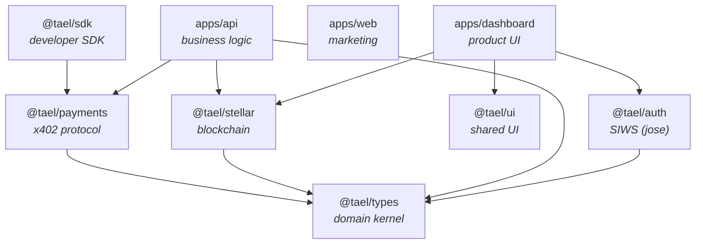

# Architecture

This document explains how the Tael monorepo is structured and _why_. It is the reference for every
engineer working here: what each folder is for, where new code belongs, and the conventions that keep
the codebase coherent as the team grows past 20 engineers.

> **Status:** Phase 2. Phase 1 (SDK, x402 payments, Stellar settlement, API, marketing site) plus the
> **dashboard** and shared **`@tael/ui`** are implemented. Later products are **designed for** here but
> not yet scaffolded — see [Deferred workspaces](#deferred-workspaces). We deliberately have **no
> placeholder packages**: a workspace exists only when it has a real, single responsibility and at
> least one consumer.

---

## Table of contents

1. [Principles](#principles)
2. [Why Turborepo + pnpm](#why-turborepo--pnpm)
3. [Repository layout](#repository-layout)
4. [Folder-by-folder](#folder-by-folder)
5. [Package boundaries & dependency graph](#package-boundaries--dependency-graph)
6. [Domain-Driven Design & feature modules](#domain-driven-design--feature-modules)
7. [Dashboard architecture](#dashboard-architecture)
8. [Just-in-Time packages (build & DX)](#just-in-time-packages-build--dx)
9. [Environment variables](#environment-variables)
10. [Testing](#testing)
11. [Linting & formatting](#linting--formatting)
12. [CI/CD](#cicd)
13. [Release workflow](#release-workflow)
14. [Coding standards & naming conventions](#coding-standards--naming-conventions)
15. [Deferred workspaces](#deferred-workspaces)
16. [Recreate from scratch](#recreate-from-scratch)

---

## Principles

- **Clear package boundaries.** Every package has one nameable responsibility. If you can't say what
  a package is _for_ in a sentence, it shouldn't exist.
- **Domain-driven, feature-first.** Business logic is organized by domain (wallets, payments), not by
  technical layer. A domain owns its schema, service, and persistence in one folder.
- **Minimal abstractions.** No indirection until a second consumer forces it. We extract shared code
  when duplication is real, not anticipated.
- **Separation of concerns.** Infrastructure, blockchain, payments, SDKs, frontend, and business logic
  live in distinct, independently-testable units.
- **Modular monolith, not microservices.** Domains are modules inside one deployable API. We add
  services only when scaling _demands_ it, never by default.
- **Great DX & fast local dev.** Zero build step for local development (see
  [Just-in-Time packages](#just-in-time-packages-build--dx)); one command runs everything.

## Why Turborepo + pnpm

- **pnpm workspaces** give content-addressed, disk-efficient installs and strict, non-flat
  `node_modules` (a package can only import what it declares). A single **catalog** in
  `pnpm-workspace.yaml` pins every third-party version once, eliminating drift across workspaces.
- **Turborepo** provides task orchestration with content-hash caching and correct topological
  ordering. `turbo run build` only rebuilds what changed; CI caching makes PRs fast.

## Repository layout

```text
tael-protocol/
├─ apps/                     # Deployable applications (not published to npm)
│  ├─ api/                   # @tael/api   — Hono + tRPC modular monolith
│  ├─ web/                   # web         — Next.js 15 marketing site
│  └─ dashboard/             # dashboard   — Next.js 15 product dashboard
├─ packages/                 # Published libraries + shared config (@tael/*)
│  ├─ config/                # @tael/config   — tsconfig/eslint/prettier/tailwind presets
│  ├─ types/                 # @tael/types    — shared domain kernel (value objects, zod, errors)
│  ├─ payments/              # @tael/payments — x402 / HTTP-402 protocol
│  ├─ stellar/               # @tael/stellar  — USDC settlement primitives
│  ├─ sdk/                   # @tael/sdk      — the tael() developer SDK
│  └─ ui/                    # @tael/ui       — shared React components (shadcn/ui)
├─ .changeset/               # Versioning & changelog (Changesets)
├─ .github/                  # CI, release workflows, PR template, CODEOWNERS
├─ .vscode/                  # Recommended extensions + workspace settings
├─ ARCHITECTURE.md           # This document
├─ CONTRIBUTING.md           # How to work in this repo
├─ package.json              # Root scripts (delegate to turbo) + repo-wide devDeps
├─ pnpm-workspace.yaml       # Workspace globs + dependency catalog
└─ turbo.json                # Task pipeline (build/dev/test/typecheck/clean)
```

## Folder-by-folder

### `apps/`

- **Why it exists:** Runnable, deployable products. Each app is a composition root — it wires
  `packages/*` together and owns its own configuration and lifecycle.
- **Belongs here:** Next.js/Node applications; app-specific routes, pages, servers, and env schemas.
- **Never here:** Reusable library code (extract to `packages/*`); anything another app would import.
  Apps never import each other.

### `apps/api`

- **Why:** The backend — a **modular monolith** on Hono (HTTP) + tRPC (typed RPC). Domains are
  modules, not deployments.
- **Belongs:** Feature modules under `src/modules/*`, the tRPC router, the composition root
  (`container.ts`), env validation (`env.ts`).
- **Never:** Chain-specific code (belongs in `@tael/stellar`), payment-protocol wire format (belongs
  in `@tael/payments`), or shared domain types (belong in `@tael/types`).

### `apps/web`

- **Why:** The public marketing site (Next.js 15 App Router).
- **Belongs:** Pages, layouts, marketing components, Tailwind styling.
- **Never:** Business logic or direct database access. Shared components live in `@tael/ui`; `web`
  adopts them incrementally.

### `apps/dashboard`

- **Why:** The primary product surface (Next.js 15 App Router) — where users manage wallets,
  capabilities, agents, and revenue. See [Dashboard architecture](#dashboard-architecture).
- **Belongs:** Route groups, layouts, feature modules (`features/*`), app-shell components, the auth
  middleware shell.
- **Never:** Business logic or persistence (that's the API's job); reusable components (those go in
  `@tael/ui`).

### `packages/`

- **Why it exists:** Reusable, independently-versioned libraries and shared tooling. This is where the
  system's real capabilities live.
- **Belongs here:** Code imported by more than one workspace, or published to npm as `@tael/*`.
- **Never here:** App-specific code, or a "utils"/"common" junk drawer. Each package earns its place.

### `packages/config`

- **Why:** One source of truth for tooling so every workspace lints, formats, and compiles identically.
- **Belongs:** `tsconfig` presets, the flat ESLint config, the Prettier config, the Tailwind preset.
- **Never:** Runtime code or business logic. It ships config, nothing else.

### `packages/types`

- **Why:** The **shared domain kernel** — the vocabulary every layer agrees on.
- **Belongs:** Value objects (`Money`), zod schemas + inferred types (wallet, capability, payment,
  policy), and the `TaelError` taxonomy.
- **Never:** I/O, side effects, framework code, or an import of any other `@tael/*` package. It is the
  root of the dependency graph and depends only on `zod`.

### `packages/payments`

- **Why:** The x402 / HTTP-402 payment protocol, typed end to end.
- **Belongs:** 402 challenge construction, `X-PAYMENT` encode/decode, and verification _orchestration_
  through a `PaymentVerifier` port.
- **Never:** Blockchain calls, HTTP framework code, persistence. It owns the protocol envelope, not
  settlement.

### `packages/stellar`

- **Why:** Stellar/Soroban settlement primitives — the blockchain layer.
- **Belongs:** USDC asset construction, network config, transaction submission; later, Soroban calls.
- **Never:** x402 logic or HTTP. It knows nothing about payments — the API composes the two.

### `packages/sdk`

- **Why:** The developer-facing SDK: wrap any handler with payments in one call.
- **Belongs:** The `tael()` / `createTael()` ergonomics over the Web `Request`/`Response` standard.
- **Never:** Chain-specific settlement (injected via a verifier) or protocol internals (owned by
  `@tael/payments`).

### `packages/ui`

- **Why:** Shared React components (shadcn/ui: Radix + Tailwind + CVA) for every frontend. Justified
  once a second frontend (the dashboard) needed the same components.
- **Belongs:** Reusable presentational components, the `cn()` helper, and the theme tokens
  (`globals.css`). Ships **source**; consumers compile it via Next's `transpilePackages`.
- **Never:** Data fetching, business logic, or app-specific composition (those live in an app's
  `features/`).

### `packages/auth`

- **Why:** Sign-In-With-Stellar primitives — challenge generation + session tokens (JWT via `jose`).
  The wallet is the identity; no passwords, no database.
- **Belongs:** `createChallenge` / `verifyChallengeToken`, `createSessionToken` / `verifySessionToken`.
- **Never:** the Stellar SDK. It is deliberately **`jose`-only and edge-safe** so `verifySessionToken`
  can run in Next.js middleware. Wallet-**signature** verification lives in `@tael/stellar`
  (`verifySignedMessage`); the dashboard's `/api/auth/verify` route composes the two on Node.

## Package boundaries & dependency graph

Dependencies flow **one way**: apps → libraries → the shared kernel. There are no cycles, and
`exports` maps forbid deep imports (`@tael/x/src/...`), so refactors inside a package never leak.



`@tael/config` is a **dev-only** dependency of every workspace (tooling presets), so it's omitted from
the runtime graph above. Key rules enforced by this shape:

- `types` never imports another `@tael/*` package.
- `payments` and `stellar` are **siblings** — neither depends on the other. Their composition (making a
  Stellar-backed `PaymentVerifier`) happens once, in `apps/api/src/container.ts`.
- `@tael/ui` is a leaf consumed by frontends; `apps/web` adopts it incrementally.
- `apps/*` are sinks: nothing imports them.

## Domain-Driven Design & feature modules

Business logic in `apps/api` is organized by **domain**, not by technical layer. Everything for a
domain lives in one folder:

```text
apps/api/src/modules/<domain>/
  <domain>.schema.ts       # zod input schemas (re-use @tael/types)
  <domain>.repository.ts   # a persistence PORT (interface) + in-memory adapter
  <domain>.service.ts      # business logic — pure, framework-free, unit-testable
  <domain>.router.ts       # tRPC router — thin: validate, delegate, return
```

- **Depend on ports, not stores.** Services take a `*Repository` _interface_. The default adapter is
  in-memory; a Drizzle/Postgres adapter (via a future `@tael/database`) drops in at the composition
  root with **no change to business logic and no placeholder package today**.
- **The composition root is the only place concretes meet.** `container.ts` builds repositories,
  services, and the Stellar→payment adapter. Everything else depends on abstractions.
- **Routers stay thin.** They validate input and delegate to a service. No logic in routers.

Implemented domains: `wallets`, `payments` (plus a `/health` route). New domains follow the same
four-file shape.

## Dashboard architecture

`apps/dashboard` is the primary product surface. It mirrors the API's philosophy — thin routing,
domain logic in feature modules — adapted to the Next.js App Router.

- **Route groups split the shells.** `app/(auth)/*` is the unauthenticated shell (login/signup);
  `app/(dashboard)/*` is the authenticated shell, whose shared `layout.tsx` wraps every section in the
  sidebar + top bar.
- **Feature modules, not layers.** `features/<domain>/` holds a domain's components (marketplace cards,
  the wallet balance card, the nav config); pages under `app/(dashboard)/<section>` stay thin and
  compose them. App-shell pieces (sidebar, top bar) and generic blocks (`PageHeader`, `EmptyState`,
  `StatCard`) live in `components/`.
- **Auth is Sign-In-With-Stellar.** The login page connects a Stellar wallet (Stellar Wallets Kit) and
  signs a server challenge; `app/api/auth/*` route handlers verify the signature (`@tael/stellar`) and
  set an httpOnly session JWT (`@tael/auth`). `middleware.ts` verifies that JWT on the edge runtime —
  using only `@tael/auth` (jose), never the Stellar SDK. The wallet is the identity; no database.
- **Shared UI comes from `@tael/ui`.** The dashboard consumes the design system (compiled via Next's
  `transpilePackages`); tokens ship from `@tael/ui/globals.css` and the `@tael/config` Tailwind preset.

The section list (Overview, Wallet, Marketplace, My Capabilities, My Agents, Analytics, Payments,
Reviews, Organizations, API Keys, Settings) is driven from `features/navigation/nav.config.ts`.

## Just-in-Time packages (build & DX)

Workspace packages export their **TypeScript source** directly:

```jsonc
// packages/*/package.json
"exports":       { ".": { "types": "./src/index.ts", "default": "./src/index.ts" } },
"publishConfig": { "exports": { ".": { "types": "./dist/index.d.ts", "import": "./dist/index.js" } } }
```

- **Local dev needs no build.** `tsx` (api) and Next (web) consume package source directly; `tsc` and
  Vitest resolve types from source. Edit a package, see it live in its consumers immediately.
- **Publishing uses `dist`.** `publishConfig.exports` swaps to built output, so npm consumers get
  compiled JS + `.d.ts`. Packages build with **tsup** (ESM + declarations).
- **The API bundles for production.** `apps/api` builds a self-contained `dist/` with tsup, inlining
  `@tael/*` source and keeping npm deps (Hono, tRPC, Stellar SDK) external.

## Environment variables

- **`.env.example` is the human contract** (documented at the repo root). Copy it to `.env`; never
  commit real secrets (`.env*` is gitignored except the example).
- **Each app validates its own env at boot** with zod (`apps/api/src/env.ts`). The schema — not the
  example file — is the source of truth: a misconfigured deploy fails fast and loudly.
- **`NEXT_PUBLIC_*`** values are browser-exposed; never put secrets behind that prefix.

Key variables: `API_PORT`, `API_PUBLIC_URL`, `DATABASE_URL`/`DIRECT_URL`, `SUPABASE_*`,
`BETTER_AUTH_*`, `STELLAR_NETWORK`/`STELLAR_HORIZON_URL`/`STELLAR_RPC_URL`, `USDC_ISSUER`,
`X402_FACILITATOR_URL`, `NEXT_PUBLIC_APP_URL`/`NEXT_PUBLIC_API_URL`.

## Testing

- **Vitest** everywhere. Unit tests live beside the code as `*.test.ts`.
- **Test the seams:** value objects (`Money`), protocol round-trips (x402 encode/decode/verify),
  domain services (against the in-memory repository), and the API (`app.request()` — no port binding).
- Run all: `pnpm test`. A single package: `pnpm --filter @tael/payments test`.

## Linting & formatting

- **ESLint (flat config)** and **Prettier**, both centralized in `@tael/config` and applied
  repo-wide from the root (`pnpm lint`, `pnpm format`) — simpler and more robust than per-package
  linting, and still cached by CI.
- Rules favor signal over noise: `no-explicit-any` and unused vars are **warnings**; `import type` is
  enforced (`consistent-type-imports`) to pair with `verbatimModuleSyntax`.

## CI/CD

`.github/workflows/ci.yml` runs on every PR and push to `main`:

1. Install with a frozen lockfile (`pnpm install --frozen-lockfile`).
2. `pnpm lint` → `pnpm typecheck` → `pnpm test` → `pnpm build`.

Turbo caches each task by content hash, so unaffected work is skipped. Concurrency cancels superseded
runs. `esbuild`/`sharp` are allow-listed to run install scripts (`onlyBuiltDependencies`).

## Release workflow

`.github/workflows/release.yml` uses **Changesets**:

1. A PR that changes a published package includes a changeset (`pnpm changeset`).
2. Merging to `main` opens/updates a **"Version Packages"** PR (bumps versions + changelogs).
3. Merging _that_ PR builds and publishes the affected `@tael/*` packages to npm.

Apps (`@tael/api`, `web`) are `ignore`d — they deploy, they don't publish.

## Coding standards & naming conventions

- **Packages:** scoped `@tael/<name>`; apps are lowercase (`web`) or `@tael/<name>` if private.
- **Files:** kebab-case (`wallet.service.ts`); React components PascalCase (`HomePage`). Feature-module
  files are `<domain>.<role>.ts`.
- **TypeScript:** `strict` + `noUncheckedIndexedAccess` + `verbatimModuleSyntax`. No deep imports —
  import from a package's entry only. Prefer `import type` for types.
- **Validation at boundaries:** zod at every external edge (HTTP input, env). Internal code trusts
  its types.
- **Errors:** throw `TaelError` (or a subclass) with a `code`, never a bare `Error`.
- **Commits:** Conventional Commits (`feat:`, `fix:`, `chore:`, `refactor:`, `docs:`).

## Deferred workspaces

Designed-for but intentionally **not** scaffolded (no empty packages). Each has a clear trigger for
creation:

| Future workspace                   | Type    | Create it when…                                              |
| ---------------------------------- | ------- | ------------------------------------------------------------ |
| `apps/docs`                        | app     | public docs outgrow the marketing site                       |
| `apps/explorer`, `apps/playground` | app     | the marketplace / a payment sandbox is built                 |
| `packages/database`                | library | persistence is needed — Drizzle adapter behind the ports     |
| `packages/mcp`, `packages/agent`   | library | the MCP wrapper / agent client ship (Phase 3)                |
| `packages/policy-engine`           | library | spending policies grow beyond the `policy` schema            |
| `contracts/`                       | Rust    | settlement moves on-chain (Soroban) — behind `@tael/stellar` |

`contracts/` will be a Cargo workspace (Soroban `wallet`/`policy`/`treasury`/`settlement`); its
settlement adapter slots in behind `StellarSettlement` so no caller changes. Cargo is already present
locally, so this is purely additive.

## Recreate from scratch

The commands below reproduce the skeleton (structure + tooling). Application code is authored on top.

```bash
# 1. Init the workspace
mkdir tael-protocol && cd tael-protocol && git init
corepack enable && corepack prepare pnpm@11.5.2 --activate

# 2. Root files
pnpm init                      # then set "private": true, "type": "module"
#   add: pnpm-workspace.yaml (apps/*, packages/*, catalog), turbo.json,
#        .npmrc, .node-version, .gitignore, .editorconfig, .env.example,
#        eslint.config.js, prettier.config.js, .changeset/config.json
pnpm add -Dw turbo typescript eslint prettier @changesets/cli

# 3. Directory skeleton
mkdir -p apps/api/src apps/web/app apps/dashboard/app \
         packages/{config,types,payments,stellar,sdk,ui}/src

# 4. Shared config first (everything else extends it)
#   packages/config: tsconfig/{base,library,react-library,nextjs}.json, eslint/, prettier/, tailwind/

# 5. Libraries, in dependency order
#   types → payments → stellar → sdk ; ui (shadcn, source-only)
#   (each: package.json exports src, tsup.config.ts where published, tsconfig.json)

# 6. Apps
#   apps/api (Hono + tRPC + DDD modules), apps/web (Next.js 15), apps/dashboard (Next.js 15)

# 7. Wire it up
pnpm install
pnpm lint && pnpm typecheck && pnpm test && pnpm build
```
